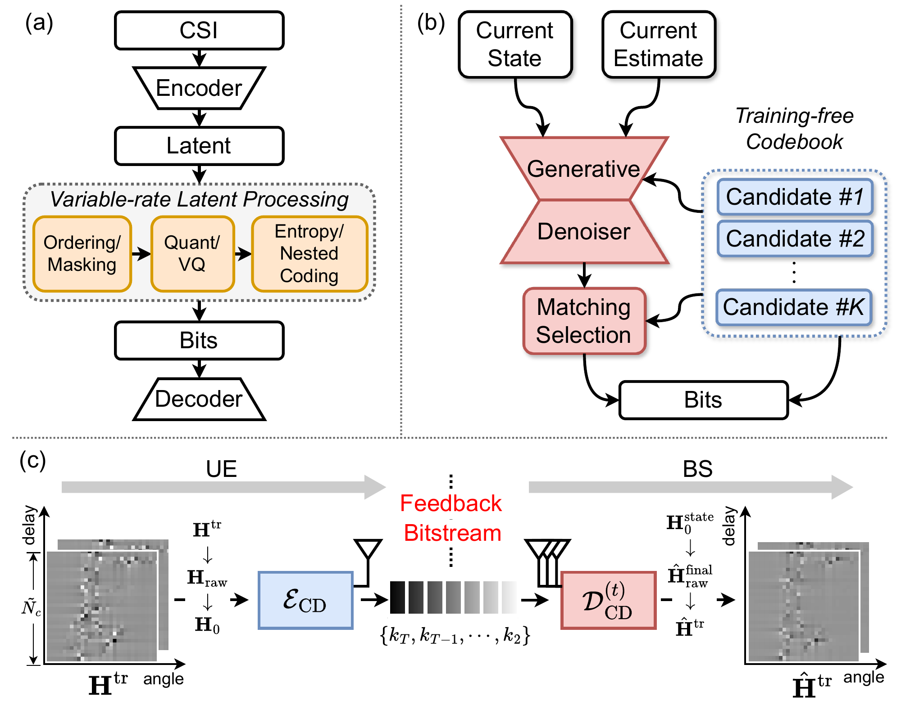

# [WCL 2026] CsiCoGen

Official implementation of the paper *[Variable-Length Finite-Rate CSI Feedback With Generative Priors][paper]*, published in **IEEE Wireless Communications Letters (WCL 2026)**.

[paper]: https://ieeexplore.ieee.org/document/11690624

## Overview

CsiCoGen represents channel state information (CSI) as an ordered sequence of Gaussian innovation indices. The encoder and receiver share a pretrained denoiser, a noise schedule, an initial state, and a pseudo-random Gaussian codebook. The encoder selects innovations that match the source CSI, and the receiver reconstructs CSI by replaying the same generative recursion.

A prefix of `L` indices uses `L × log2(K)` feedback bits, where `K` is the codebook size. Additional indices refine the reconstruction. The Gaussian codebook is generated without training and adds no learned parameters.

<p align="center">
  
</p>

*Framework. The encoder transmits innovation indices; the receiver reconstructs CSI from the shared generative prior.*

The two pretrained model families are:

| Model | Parameters | Timesteps | Codebook size |
| --- | ---: | --- | ---: |
| CsiCoGen | 800,162 | 100 / 200 | 256 |
| CsiCoGen-Lite | 155,474 | 100 / 200 | 256 |

Both families include indoor and outdoor checkpoints. Sampling options include:

- **Full sampling:** one denoiser call per timestep.
- **D/F sampling:** `D` denoiser calls while retaining the feedback trajectory `F=T`. D20/F200 and D10/F200 each use 199 indices and 1592 bits.
- **CsiCoGen-Turbo:** macro-step sampling with intermediate denoiser refreshes. The `s30` preset at `T=100`, `K=2048` uses 99 indices, 8 denoiser calls, and 1089 bits.

D/F sampling and Turbo use separate state updates while sharing network definitions, training, normalization, codebooks, and reconstruction metrics.

## Environment Setup

The results below were measured with Python 3.9.25, PyTorch 2.8.0+cu128, NumPy 2.0.1, and an NVIDIA RTX 4090 GPU.

```bash
conda create -n csicogen python=3.9 -y
conda activate csicogen
pip install -r requirements.txt
```

For the CUDA wheel used in verification:

```bash
pip install torch==2.8.0 --index-url https://download.pytorch.org/whl/cu128
```

Run commands from this directory. Use `--gpu 0` to select a GPU or `--cpu` for a small CPU check. Full release evaluations used `--infer-batch 2000`; reduce it when GPU memory is limited.

## Pretrained Models and Data

Pretrained weights are hosted on [Hugging Face](https://huggingface.co/CsiCoGen/CsiCoGen), alongside the [COST2100 dataset](https://huggingface.co/datasets/CsiCoGen/COST2100). Both CsiCoGen and CsiCoGen-Lite support indoor/outdoor scenes and 100/200 timesteps.

To prepare all assets in advance:

```bash
python main.py download all --family all
```

Or download one configuration:

```bash
python main.py download models --family CsiCoGen --scene indoor --timesteps 100
python main.py download data --scene indoor --split test
```

Defaults are `checkpoints/` and `data/COST2100/`. Override them with `--checkpoint-root` and `--data-root`, or set `CSICOGEN_CHECKPOINT_ROOT` and `CSICOGEN_DATA_ROOT`. Add `--local-files-only` when the required files are already present.

```text
checkpoints/
├── CsiCoGen/{indoor,outdoor}/{T100,T200}/
│   ├── csicogen.ckpt
│   ├── normalization.npz
│   └── config.yaml
├── CsiCoGen-Lite/{indoor,outdoor}/{T100,T200}/
│   ├── csicogen_lite.ckpt
│   ├── normalization.npz
│   └── config.yaml
└── codebooks/
    ├── T100_K256_seed42.pt
    └── T200_K256_seed42.pt
```

The download includes the shared Gaussian codebooks. Additional codebook sizes are generated locally from a fixed seed and cached under `checkpoints/generated_codebooks/`.

### COST2100

The dataset is provided as `.mat` array files and loaded with SciPy.

| Split | Indoor array file | Outdoor array file | Samples per scene |
| --- | --- | --- | ---: |
| Training | `DATA_Htrainin.mat` | `DATA_Htrainout.mat` | 100,000 |
| Validation | `DATA_Hvalin.mat` | `DATA_Hvalout.mat` | 30,000 |
| Test | `DATA_Htestin.mat` | `DATA_Htestout.mat` | 20,000 |
| Test frequency reference | `DATA_HtestFin_all.mat` | `DATA_HtestFout_all.mat` | Same 20,000 test samples |

`HT` arrays have shape `[N,2048]` and are reshaped to `[N,2,32,32]`. The two channels contain the real and imaginary components. Complex `HF_all` arrays have shape `[N,4000]` and are reshaped to `[N,32,125]` for channel-correlation evaluation.

The loader standardizes CSI with the training-set statistics in `normalization.npz`:

```text
H0 = (HT - mean) / (std + 1e-7)
HT_hat = H0_hat * (std + 1e-7) + mean
```

## Run Test

### CsiCoGen: 792 Bits

`T=100`, `K=256`, full prefix of 99 indices.

```bash
python main.py infer --mode CsiCoGen --scene indoor --timesteps 100 --gpu 0
python main.py infer --mode CsiCoGen --scene outdoor --timesteps 100 --gpu 0
```

### CsiCoGen: 1592 Bits

`T=200`, `K=256`, full prefix of 199 indices.

```bash
python main.py infer --mode CsiCoGen --scene indoor --timesteps 200 --gpu 0
python main.py infer --mode CsiCoGen --scene outdoor --timesteps 200 --gpu 0
```

### Reduced Denoiser Calls

Both configurations retain **1592 feedback bits**.

```bash
python main.py infer --mode CsiCoGen --scene outdoor --timesteps 200 \
  --denoiser-calls 20 --gpu 0

python main.py infer --mode CsiCoGen --scene outdoor --timesteps 200 \
  --denoiser-calls 10 --gpu 0
```

### CsiCoGen-Lite

```bash
python main.py infer --mode CsiCoGen-Lite --scene outdoor --timesteps 200 \
  --denoiser-calls 20 --gpu 0

python main.py infer --mode CsiCoGen-Lite --scene outdoor --timesteps 200 \
  --denoiser-calls 10 --gpu 0
```

Omit `--denoiser-calls` for full sampling. Indoor and T100 checkpoints are also available.

### CsiCoGen-Turbo

Apply the Turbo sampler to the released T100 CsiCoGen prior:

```bash
python main.py infer --mode ddpm-turbo --scene indoor --schedule s30 --gpu 0
python main.py infer --mode ddpm-turbo --scene outdoor --schedule s30 --gpu 0
```

The `s30` preset uses `T=100`, `K=2048`, **8 denoiser calls**, and **1089 bits**, with refresh points at timesteps 84, 54, and 19.

For a full-call comparison with the same codebook size:

```bash
python main.py infer --mode ddpm --scene outdoor --timesteps 100 \
  --codebook-size 2048 --schedule full --gpu 0
```

Available schedules are `full`, `s25`, `s33`, `s30`, or a specification such as `s30:k2048:t1:c1:r0.50:m8:p84-54-19`. The `s30` preset is defined for `T=100`.

### Small Check

```bash
python main.py infer --mode CsiCoGen --scene indoor --timesteps 100 \
  --max-samples 100 --infer-batch 100 --gpu 0
```

The default `--max-samples 0` evaluates the complete test split.

### Encode Only

```bash
python main.py encode --mode CsiCoGen --scene indoor --timesteps 100 \
  --run-tag indoor_encode --gpu 0
```

The command prints the generated index-file path.

### Decode Only

The receiver reconstructs CSI from indices, weights, normalization statistics, and the shared codebook.

```bash
python main.py decode --mode CsiCoGen --scene indoor --timesteps 100 \
  --indices <index-file> \
  --gpu 0
```

Add `--evaluate` to compute NMSE and channel correlation. The encoder and receiver share the model, scene, timesteps, codebook size, and sampling configuration.

### Decode a Feedback Prefix

The first 49 indices use **392 bits**:

```bash
python main.py decode --mode CsiCoGen --scene indoor --timesteps 100 \
  --indices <index-file> \
  --prefix-length 49 --gpu 0
```

A zero-length prefix reconstructs from the shared initial state. The receiver ignores all indices beyond the requested prefix. Arbitrary receiver prefixes use the full CsiCoGen or CsiCoGen-Lite sampler. Turbo progressive evaluation uses `infer --prefix-lengths 25,50,99`.

### Run Files

Each run writes its configuration, log, indices, reconstruction, and metrics under a separate directory in `outputs/`. Use `--output-root` and `--run-tag` to choose the location and name. Generated run files are excluded from version control.

Feedback rates count the meaningful transmitted indices. The deterministic `t=0` transition uses no feedback bits. For `K>256`, the saved indices use `uint16`; container size differs from the logical bitrate.

## Train

Train a CsiCoGen prior:

```bash
python main.py train --mode CsiCoGen --scene indoor --timesteps 100 \
  --epochs 1000 --batch 200 --gpu 0
```

Train CsiCoGen-Lite:

```bash
python main.py train --mode CsiCoGen-Lite --scene outdoor --timesteps 200 \
  --epochs 2000 --batch 200 --gpu 0
```

Training reads the training split and monitors reconstruction quality on `TEST_FILE`. To use the validation split, set `TEST_FILE` to the validation file and `GT_RAW_FILE: ""` in a YAML override.

Training writes `csicogen.ckpt` or `csicogen_lite.ckpt`, depending on the model family. Exponential moving average (EMA) weights use the `_ema.ckpt` suffix. The corresponding training statistics are saved as `normalization.npz`.

## Configuration

Settings are applied in this order:

```text
configs/base.yaml
configs/scenes/<scene>.yaml
configs/models/<family>_T<T>.yaml or configs/modes/<mode>.yaml
optional --config <override.yaml>
CLI options
```

Use `--ckpt` and `--norm-stats` to load a local model with its architecture configuration. Use `--codebook` to supply an explicit shared codebook.

## Results

Each configuration was evaluated on **20,000 test samples per scene** with inference batch size 2000. Full-sampling results:

| Model | Scene | T | Bits | NMSE (dB) | rho |
| --- | --- | ---: | ---: | ---: | ---: |
| CsiCoGen | Indoor | 100 | 792 | -28.5807 | 0.996440 |
| CsiCoGen | Outdoor | 100 | 792 | -13.9602 | 0.959711 |
| CsiCoGen | Indoor | 200 | 1592 | -30.7150 | 0.996702 |
| CsiCoGen | Outdoor | 200 | 1592 | -20.3823 | 0.974867 |
| CsiCoGen-Lite | Indoor | 100 | 792 | -25.4930 | 0.995641 |
| CsiCoGen-Lite | Outdoor | 100 | 792 | -12.9638 | 0.954491 |
| CsiCoGen-Lite | Indoor | 200 | 1592 | -27.4056 | 0.996144 |
| CsiCoGen-Lite | Outdoor | 200 | 1592 | -18.8837 | 0.972966 |

Outdoor D/F sampling with `T=200`, `K=256`, and **1592 feedback bits**:

| Model | Denoiser calls | NMSE (dB) |
| --- | ---: | ---: |
| CsiCoGen | 20 | -19.4781 |
| CsiCoGen | 10 | -17.5392 |
| CsiCoGen-Lite | 20 | -18.1579 |
| CsiCoGen-Lite | 10 | -16.4653 |

Turbo measurements using the released T100 CsiCoGen priors:

| Scene | K | Calls | Bits | NMSE (dB) | rho |
| --- | ---: | ---: | ---: | ---: | ---: |
| Indoor | 2048 | 8 | 1089 | -27.6442 | 0.996325 |
| Outdoor | 2048 | 8 | 1089 | -13.5639 | 0.958710 |

Use `--config configs/deterministic.yaml` for the deterministic evaluation preset.

NMSE is computed after subtracting `0.5` from the source and reconstructed CSI. The evaluator averages per-sample error/power ratios within batches of 500, converts each batch mean to dB, and averages the dB values by sample count. The optional `nmse_global_db` field converts the mean of all linear per-sample ratios to dB.

Channel correlation (`rho`) uses the frequency references in `HF_all`. The evaluator pads the delay axis from 32 to 257, applies an FFT, and retains the first 125 frequency bins.

## Layout

```text
.
├── main.py                  # Unified commands
├── configs/                 # Models, scenes, sampling, asset manifests
├── modules/
│   ├── artifacts.py         # Automatic downloads and checksum checks
│   ├── csicogen_codec.py    # CsiCoGen and D/F sampling
│   ├── codec.py             # Turbo codec
│   ├── receiver.py          # Independent decoding and prefixes
│   ├── codebook.py          # Shared Gaussian codebooks
│   ├── diffusion.py         # Model, data, and diffusion helpers
│   ├── training.py          # Denoiser training
│   └── schedules.py         # Sampling schedules and bitrate accounting
├── models/                  # CsiCoGen and CsiCoGen-Lite denoisers
├── utils/                   # Reconstruction metrics and runtime helpers
└── figs/                    # Framework figure
```

## Citation

```bibtex
@article{cheng2026variable,
  title={Variable-Length Finite-Rate CSI Feedback With Generative Priors},
  author={Cheng, Yangxuan and Meng, Fanyang and Zou, Jian and Xie, Jiacheng and
          Zhang, Zhongqiang and Wang, Ye and Liang, Yongsheng},
  journal={IEEE Wireless Communications Letters},
  year={2026},
}
```

## Acknowledgement

We thank the authors of the COST2100 channel model, CsiNet, and CRNet for their data, implementations, and evaluation conventions. Please cite the relevant original works when using their contributions.

## License

CsiCoGen code and pretrained assets are available for **noncommercial research** under the [CsiCoGen Noncommercial Research License](LICENSE). Commercial use and redistribution of original or modified model assets require prior written authorization.
